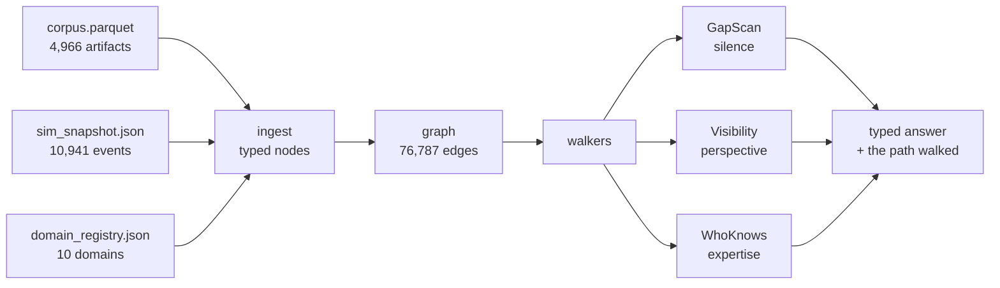
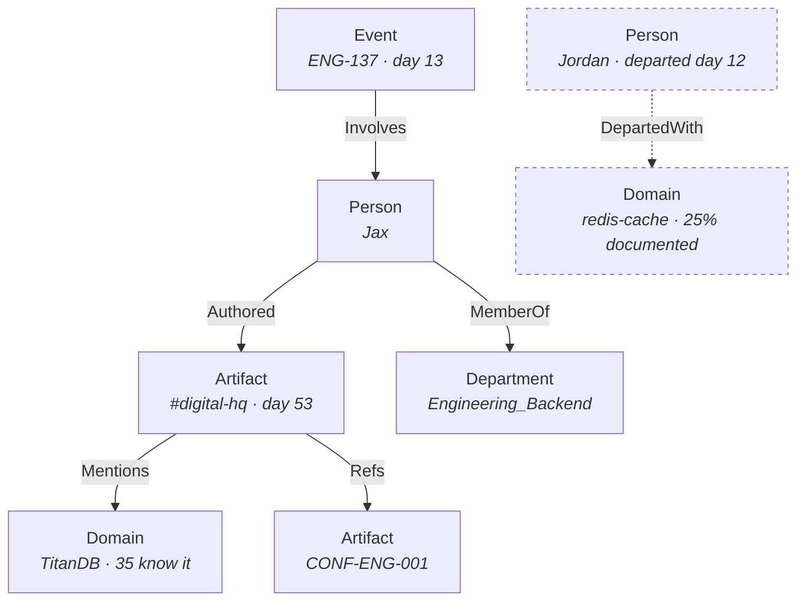

# orgmem

**Observability for organizations.** Every RAG system indexes what a company wrote down. orgmem maps
what a company *knows* — who knows it, where it's written, and where it isn't.

Built in [Jac](https://github.com/jaseci-labs/jac) at **JacHacks SF 2026** — Founders Inc. @ Fort
Mason, 26 July 2026. No database, no ORM, no vector store, no prompt strings.

[Dataset on Hugging Face](https://huggingface.co/datasets/aeriesec/orgforge) ·
[orgforge generator](https://github.com/tenurehq/orgforge) ·
[Jac language](https://github.com/jaseci-labs/jac)

```
4,966 artifacts  →  76,787 typed edges  in 6.4s
94.7% on ground truth (54/57 scored) · 96.3% on silence questions vs a 55.6% baseline
```

---

## The one thing that matters

Retrieval can **fail to find** something. It cannot **establish that nothing is there**.

Top-k similarity is never exhaustive and never returns empty — when the answer doesn't exist it
returns the nearest thing instead, and a model confabulates from it. So the single most valuable
question an organization has is the one its tools structurally cannot answer:

> *An incident opened on day 8. Was a postmortem ever written?*

A graph answers by walking a **bounded** space and counting zero. **Zero neighbours of the expected
type is a fact, not a failure.** The bound is the proof — which is why the walker below carries
`window_days` and `max_nodes` and reports what it searched.

Everything else here follows from that.

---

## Results

Measured against the ground truth shipped with the dataset. Reproduce with `jac run main.jac` then
the `EvalRun` walker; the raw output is committed as [`eval_results.json`](eval_results.json).

| Class | Score | Constant baseline | What it asks |
|---|---|---|---|
| **SILENCE** | **26/27 · 96.3%** | 55.6% | Did the expected follow-up ever happen? |
| **PERSPECTIVE** | **28/30 · 93.3%** | 63.3% | Could this person have known X on day N? |
| **Overall** | **54/57 · 94.7%** | — | |
| COUNTERFACTUAL | *21 skipped* | — | Would Y still have happened without X? |

**We do not score COUNTERFACTUAL, deliberately.** It asks whether an outcome survives removing a
cause. That is the simulator's internal counterfactual and is not decidable from the artifacts, so
it is excluded rather than guessed. Declining to claim causal reasoning we can't verify is the
point of the project, not a gap in it.

The SILENCE baseline matters: the 27 questions split 15 yes / 12 no, so a system that always
answers *"no, nothing was written"* scores **55.6%**. Beating it requires actually looking.

<details>
<summary><b>All three failures, in full</b></summary>

| id | expected | got | why |
|---|---|---|---|
| `silence_EVT-18-knowledge_gap_detected-1367_confluence_created` | true | false | `searched=4` — the causal closure was too tight and missed a real page |
| `perspective_Alex_EVT-13-incident_opened-1396` | true | false | `AFTER_AS_OF_DAY` — boundary condition on the day cursor |
| `perspective_Chloe_EVT-58-pr_review-1499` | false | true | `IN_CONE` — reachable but shouldn't count as knowledge |

Two of the three are boundary conditions on the time cone. The first is the interesting one: our
bounded space is the *causal* closure of the trigger, and tightening it to avoid false positives
cost us one true positive. Widening it to an actor/time sweep makes every SILENCE answer "yes".

</details>

---

## How it works



The path a walker took **is** the citation. Provenance is a by-product of traversal, not a parallel
system to keep in sync.

### The schema

Thirteen node types and thirteen edge types. The names on the edges are what let a walker ask a
*specific* question instead of a *similar* one.



`DepartedWith` is the only edge that describes an **absence** — a person who left, and the domain
that left with them.

<details>
<summary><b>Full type list</b></summary>

**Nodes** — five entity types `Person` `Department` `Domain` `Event` `Channel`, plus eight
`Artifact` subtypes `SlackThread` `Email` `ConfluencePage` `JiraTicket` `ZoomTranscript`
`PullRequest` `ZDTicket` `SFOpportunity` — thirteen instantiable types. `Ent` and `Artifact` are
abstract bases; `Hub` and `Index` are infrastructure, giving seventeen `node` declarations in all.

**Edges** — `Authored` `Refs` `Mentions` `Involves` `MemberOf` `Concerns` `Produced` `Relates`
`CoOccurs` `InChannel` `Subscribes` `Estranged` `DepartedWith`

</details>

---

## The retriever is a walker

Not a query against a store — an agent moving through the graph, with behaviour attached per node
type via dispatch-on-arrival. This is `GapScan`, the walker that answers silence questions, verbatim
from [`main.jac`](main.jac):

```jac
walker :pub GapScan {
    has trigger_event_id: str = "";
    has expected_response_type: str = "";
    has window_days: int = 14;
    has max_nodes: int = 400;

    has searched: list[str] = [];
    has found: list[str] = [];

    can start with Root entry { visit HUB; }

    can begin with Hub entry {
        e: Event = EVENTS[self.trigger_event_id];
        self.lo = e.day;
        self.hi = e.day + self.window_days;
        visit e;
    }

    # The bounded space is the CAUSAL closure of the trigger: the artifacts it
    # produced, whatever those reference, and the events that produced those —
    # not everything the trigger's actors happened to touch that fortnight.
    # Widening it to the actor/time sweep makes every SILENCE answer "yes".
    can at_event with Event entry {
        for a in [here ->:Produced:->] {
            self.consider(a);
            if self.admit(str(a.gid)) { visit a; }
        }
    }

    # Dispatch-on-arrival: the reference graph out of an artifact, plus the
    # events that emitted it, are the only legitimate continuations.
    can at_artifact with Artifact entry { ... }
}
```

Three things to notice:

1. **`can <name> with <NodeType> entry`** — behaviour binds to the node type. Adding a ninth artifact
   source means adding an ability, not editing a dispatcher.
2. **`[here ->:Produced:->]`** — edge-typed traversal. The query says *what kind of relationship*,
   which is exactly what a vector index cannot express.
3. **`searched` is reported alongside the answer.** A "no" that doesn't say what it looked at is
   indistinguishable from a bug.

### The other walkers

| Walker | Answers |
|---|---|
| `GapScan` | Was the expected follow-up ever written? Bounded causal closure, count zero. |
| `Visibility` | Could this person have known X by day N? Reachability bounded by day and access. |
| `WhoKnows` | Who actually knows this domain? Ranked by demonstrated engagement, with bus factor. |
| `Expand` | Neighbourhood of a node, for the UI. |
| `NodeCard` | Everything renderable about one node. |
| `GraphSlice` | A department- and day-bounded slice for the canvas. |
| `EvalRun` | Runs all 78 benchmark questions and writes `eval_results.json`. |
| `Stats` | Graph totals. |

---

## The data

[`aeriesec/orgforge`](https://huggingface.co/datasets/aeriesec/orgforge) (MIT) —
[generator source](https://github.com/tenurehq/orgforge). A simulated sports-technology company,
**Apex Athletics**: marathon pacing services, athlete leaderboards, telemetry pipelines.

| | |
|---|---|
| People | 46 across 8 departments |
| Window | **60 working days** (2026-01-01 → 2026-03-25, 84 calendar days) |
| Artifacts | 4,966 — 3,303 Slack · 610 email · 479 Confluence · 304 Jira · 208 transcripts · 57 PRs · 3 Salesforce · 2 Zendesk |
| Events | 10,941 |
| Domains | 10 knowledge domains with ownership and documentation coverage |
| Benchmark | 78 questions with machine-checkable ground truth |

Every artifact descends from a single causal event log, which is what makes it a genuine graph
rather than a pile of documents.

**The corpus counts in *simulation days*, which are working days.** Jira artifacts carry calendar
timestamps, so incident dates are converted by counting weekdays from 2026-01-01 — verified against
the two `event_log` rows that carry both a `day` and a `date` (2026-03-16 → day 53, 2026-03-17 → day
54). This is why we say "60 working days" and not "60 days".

### One thing the data says

```
day 12   Jordan leaves — owning auth-service, redis-cache and oauth2-flow, 25% documented
day 13   ENG-137: a Redis TTL misconfiguration overloads TitanDB. Assigned to Yusuf.
```

Two independent records, one day apart. **We report the adjacency and do not claim the cause** —
consistent with declining to score COUNTERFACTUAL. The inference belongs to the person reading it.

Large data files are not committed:

```python
from datasets import load_dataset
load_dataset("aeriesec/orgforge")
```

---

## Running it

Requires the Jac toolchain — **0.34.x and Python ≥ 3.14**. Note that PyPI `jaclang` is 0.16.7 and
does *not* have the language features used here.

```bash
jac check main.jac              # type + ownership check
jac run   main.jac              # build the graph — ~6.4s, persists to .jac/data/
jac start main.jac              # serve walkers over HTTP
jac dev   app.jac -p 8903       # client with hot reload → http://localhost:8903
```

The graph builds once and persists — everything reachable from `root` survives the process, so
re-running does not rebuild it. There is no save call anywhere in this project.

> **After editing any `.jac` file, do a full restart.** Hot reload silently serves stale bundles;
> see [`HANDOFF.md`](HANDOFF.md) for that and eleven other things that cost us an hour each.

---

## Layout

```
main.jac              graph build + all walkers          1,866 lines
api.jac               HTTP surface for the client          345
app.jac               client entry                          23
web/
  AppShell.jac        routing
  AppScreen.jac       app state and server calls
  GraphCanvas.jac     force-directed graph
  Shell.jac           app chrome
  card/               node cards — artifact in its own source chrome
  site/               the marketing site at "/"
data/
  corpus.parquet      artifacts
  sim_snapshot.json   event log, departures, incidents
  domain_registry.json
  eval_questions.jsonl
docs/                 card contract, graph technique notes, node-selection research
HANDOFF.md            operational notes + 12 undocumented Jac gotchas
eval_results.json     committed benchmark output
```

---

## Why Jac

The domain is a graph, so a language with graphs as a first-class data model does real work here
rather than decorative work.

- **`node` / `edge` archetypes model the domain directly.** Artifact types are *separate node types*,
  so behaviour attaches per type on arrival.
- **Walkers are the query engine.** The path walked is the citation.
- **Persistence is a language feature.** Reachability from `root`. No database, no ORM, no
  migrations, no save call.
- **One language across the stack.** The UI is Jac client components; the client/server RPC is
  generated, not hand-written. The marketing site, the graph canvas and the walkers are all Jac.

---

## Status

Hackathon build, one day. The **structural layer** — every edge derivable from the data with no
model calls — is the foundation and is deterministic. The **inferred layer** (typed judgements about
who genuinely *knows* a domain versus who merely mentioned it) sits on top and is early.

Known gaps are listed in [`HANDOFF.md`](HANDOFF.md) rather than hidden.

## Credits

Dataset [`aeriesec/orgforge`](https://huggingface.co/datasets/aeriesec/orgforge) (MIT), generated by
[tenurehq/orgforge](https://github.com/tenurehq/orgforge). Graph rendering via
`react-force-graph-2d`. Everything else written during the event.
